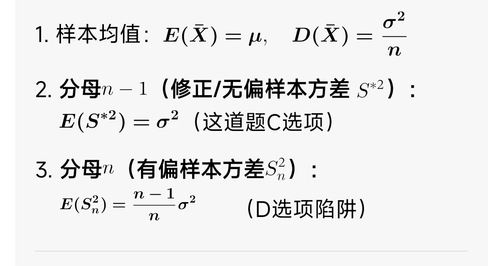

# 概率论与数理统计

### 单总体均值假设验证

<figure><figcaption></figcaption></figure>

不等于为双侧=>/2

### 联合概率密度函数

\=联合密度/边缘密度（微积分）

边缘密度=x到y的微积分

<figure><figcaption></figcaption></figure>

### 概率密度函数

* 默认：-无穷与+无穷之间的微积分为1，求出密度函数，再根据要求求微积分

<figure><figcaption></figcaption></figure>

* Z = F1(x)F2(x)和 Z = 1- \[1-F1(x)]\[1-Fx(2)]是分布函数
* 分布函数：单调不减+右连续+【x\~-无穷=0,x\~+无穷=1】+函数值域0-1
*

### t分布

* D(x) = 系数的平方和
* 被除数=原式/ （根号（D(X)=方差）
* 除数=根号(原式/D(x))

###

### 抽样统计

* 记住用占比的方式

### 分布的性质、计算

* 满足：

<figure><figcaption></figcaption></figure>

### 一维随机变量函数

连续型随机变量X的分布函数为FX(X)，则Y=1-(e^x)的分布函数是

*   关键点：单调减函数⇒ P{Y<=y}=P{1-e^x<=y}

    <figure><figcaption></figcaption></figure>

### 参数估计

#### 三大抽样分布

* t分布：X服从标准正态分布N(0,1)，Y服从x^2(n)分布，那么Z=X/根号(Y/N)的分布作为t分布，作为Z\~t(n)
* x^2卡方分布：独立标准正态平方相加

#### 伽马分布

<figure><figcaption></figcaption></figure>

* 伽马分布，看x的幂⇒ 1 ⇒ k-1 ⇒ k=2
* 所以样本均值x⇒ k/入

#### 相关系数

x与y相互独立⇒ 随机变量x,y的相关系数 ρxy=0，充分不必要条件，因为y的取值对x的取值分布有影响

#### θ的矩阵估计值

* E(x)⇒ 分布律X\*pk之和，均值x=总体X的样本值的平均值
* θ=(1-E(x))/5

### 抽样统计

* 分层抽样：由于两边差异明显，取份不一样⇒ 先分类，每层内部抽样，适合总体内部差异大
* 系统抽样：先排序，按固定间隔抽，适合总体均匀，没有明显分类⇒ 等距抽样
* 简单随机抽样：每个个体被抽到概率相等⇒ 总体数量比较小好用，不分组不分层不排序

### 随机事件及其运算

#### 条件概率

* 已知目标被击中，则被甲射中概率，甲射中概率|被射中概率⇒ 甲概率+乙概率-甲乙共同概率=被射中概率⇒ 甲概率/被射中概率
*

### 分布

#### 离散型分布

E期望 D方差

* 0-1分布：E(x)⇒ p、D(x)⇒ p(1-p)
* 二项分布：X\~B    E(x)⇒ np、D(x)⇒ （第一个参数为n，第二个参数p)⇒ np(1-p)
* 泊松分布：X\~P E(x)入、D(x)入

#### 连续型分布

* 均匀分布 X\~U\[a,b] ，E(x) ⇒ (a+b)/2  $$D(x)=(b-a)^2/12$$
* 指数分布X\~E(入)，E(x)⇒ 1/入,D(x) ⇒ 1/(入^2)
* 正态分布X\~N（μ，σ^2), E(x)=>μ, D(x)⇒ σ^2

正态分布

* X\~N（μ，σ^2），<mark style="color:$danger;">μ为对称轴，均值</mark>
* 概率密度： .png>)

#### 期望方差运算性质

* E(aX+b)⇒ aE(x)+b
* D(aX+b)⇒ a^2D(x) 常数b方差消失,a要平方
* E(X+Y)⇒ E(X)+E(Y)， 不管是否独立
* 若X、Y相互独立：
  * E(XY)⇒ E(X)E(Y)
  *   D(X+Y)⇒ D(X)+D(Y)

      <figure><figcaption></figcaption></figure>

#### 卡方分布

### 样本均值

<figure><figcaption></figcaption></figure>

### 简单概型

* P(AB^-) = P(A)-P(AB)
* P(AB) = P(A)+P(B)-P(AUB)

#### 排列组合

*

    <figure><figcaption></figcaption></figure>
* 标准差-μ/s根号(n)
