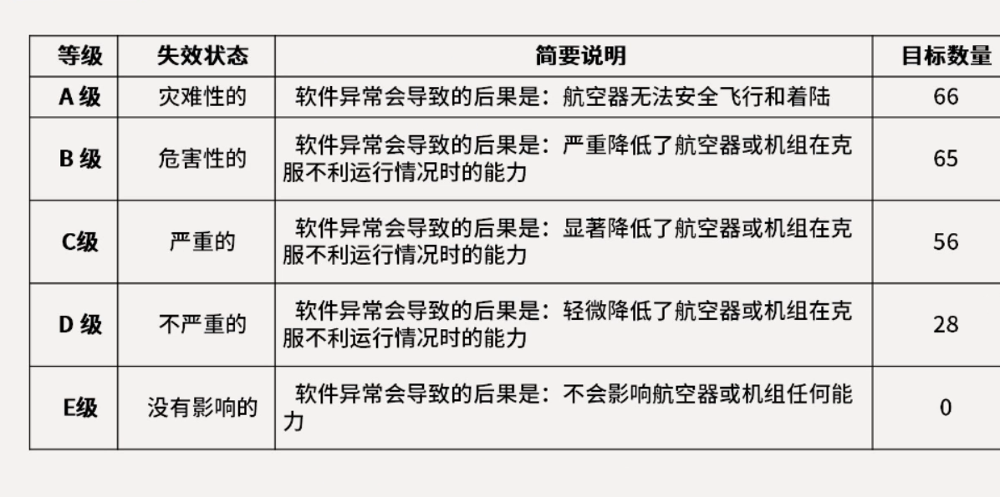

# 软件架构设计

软件架构风格是特定应用领域的**惯用模式**，架构定义一个**词汇表和一组约束**

## 软件架构风格

性能 安全性 可修改性 可用性

| 数据流风格   | 批处理、管道-过滤器        |
| ------- | ----------------- |
| 调用/返回风格 | 主程序/子程序、面向对象、层次结构 |
| 独立构件风格  | 进程通信、事件驱动系统(隐式调用) |
| 虚拟机风格   | 解释器、规则系统          |
| 仓库风格    | 数据库系统、黑板系统、超文本系统  |

### 数据流风格

**优点**

1、松耦合【高内聚-低耦合】; 2、良好的重用性/可维护性; 3、可扩展性【标准接口适配】; 4、良好的隐蔽性; 5、支持并行。

**缺点**

1、交互性较差; 2、复杂性较高; 3、性能较差(每个过滤器都需要解析与合成数据)；

**典型实例**

传统编译器、网络报文处理

### **调用/返回风格**

<figure><figcaption></figcaption></figure>

。。。。。。。。等等

仓库分为数据库系统和黑板系统

数据库系统：以数据为中心

黑板系统：可更改性和可重用性、可重用的知识源，容错性和健壮性，使用中心数据触发内部逻辑部件

缺点：测试困难;不能保证有好的解决方案;难以建立好的控制策略，低效，开发困难;缺少并行机制

**闭环控制架构(过程控制)**：解决简单闭环控制问题

简单案例：空调温控、定速巡航

**C2风格**

C2架构的基本规则:\
构件和连接件都有<mark style="color:purple;">一个顶部和一个底部</mark>。\
构件的<mark style="color:purple;">顶部</mark>要连接到<mark style="color:purple;">连接件的底部</mark>，构件的<mark style="color:purple;">底部</mark>要连接到<mark style="color:purple;">连接件的顶部</mark>，构件之间<mark style="color:purple;">不允许直连</mark>。\
一个连接件可以和<mark style="color:purple;">任意数目的其他构件和连接件</mark>连接。当两个连接件进行直接连接时，必须由<mark style="color:purple;">其中一个的底部到另一个的顶部</mark>

| 架构风格名称 | 数据处理方式                   | 系统拓展方式                   | 处理性能                                                              |
| ------ | ------------------------ | ------------------------ | ----------------------------------------------------------------- |
| 仓库     | 数据存储在中心仓库，处理流程独立，支持交互式处理 | 数据与处理解耦合，可动态添加和删除处理组件    | 
劣势：数据与处理分离，需要加载数据，性能降低

优势：数据处理组件之间一般无依赖关系，可并发调用，提高性能
 |
| 管道过滤器  | 数据驱动机制，处理流程事先确定，交互性差     | 数据与处理紧密关联，调整处理流程需要系统重新启动 | 
劣势:需要数据格式转换，性能降低 优势:支持过滤器并发调用，性能提高
                      |

管道-过滤器：\
<mark style="color:purple;">交互方式</mark>：顺序交互（前一个构件的输出作为后一个构件的输入）\
<mark style="color:purple;">数据结构</mark>：基于数据流结构 构件之间传递数据结构可能是结构体等常规数据结构\
<mark style="color:purple;">控制结构</mark>：数据流顺序传递\
<mark style="color:purple;">扩展方法</mark>：顺序结构，通过接口适配扩展

数据仓库：\
<mark style="color:purple;">交互方式</mark>：星型交互（构件和一个共享数据库进行数据）\
<mark style="color:purple;">数据结构</mark>：基于数据库结构的 构件之间传递数据是基于关系数据库\
<mark style="color:purple;">控制结构</mark>：面向应用，由业务功能驱动\
<mark style="color:purple;">扩展方法</mark>：直接通过数据库内增加数据 通过模型适配 更加灵活

数据仓库风格更加灵活\
数据仓库风格更加使用

* 虚拟机风格
  * 解释器风格
    * 提供灵活的解析引擎 适用复杂流程的处理
    * 满足数据协议兼容性需求 具有良好的灵活性
    *
*   独立构件风格

    * 进程通讯风格
    * 隐式调用风格
      * 简化构件间的交互复杂度 降低系统耦合度
      * （采用开源消息中间件作为连接构件 有效解决耦合问题 迭代过程效率高 有效解决耦合问题）
      * 基于消息中间件 能够让系统的构件化思路 得到良好实施 带来了非常清晰的数据流转结构 简化了编码难度 降低本项目二次开发的难度

    通过消息订阅 和 发布控制系统间信息交互 降低系统耦合度 提高系统的可修改性
* B/S架构风格（基于浏览器和服务器的架构）
  * 使用http协议进行通信交互 降低了系统推广和维护
  * 使用了大量的前端缓存技术和websocket技术 满足用户实时性需求 用户体验好 及时生效

采用服务器冗余和心跳检测策略 增加可用性

Lambda\
<mark style="color:purple;">批处理层</mark>\
核心功能：<mark style="color:purple;">存储数据集 和 生成BatchView</mark>\
<mark style="color:purple;">加速层</mark>\
<mark style="color:purple;">存储实时视图并处理传入的数据流 以便更新这些视图</mark>\
<mark style="color:purple;">服务层</mark>\
用于<mark style="color:purple;">响应用户的查询请求</mark> 合并batch view 和 real-time view中的结果数据集到最终数据集

Lambda架构优缺点\
优点：\
<mark style="color:blue;">容错性好</mark>\ <mark style="color:blue;">查询灵活度高</mark>\ <mark style="color:blue;">易伸缩</mark>\ <mark style="color:blue;">易扩展</mark>

缺点：\
<mark style="color:blue;">全场景覆盖带来的编码开销</mark>\ <mark style="color:blue;">针对具体场景重新离线训练收益不大</mark>\ <mark style="color:blue;">重新部署和迁移成本高</mark>

大数据工作面临的五个挑战：\
<mark style="color:blue;">1 数据获取问题</mark>\ <mark style="color:blue;">2 数据结构问题</mark>\ <mark style="color:blue;">3 数据集成问题</mark>\ <mark style="color:blue;">4 数据分析 组织 抽取 建模是大数据本质的功能性挑战</mark>\ <mark style="color:blue;">5 如何呈现数据分析的结果 与并非技术的领域专家进行交互</mark>

大数据分析步骤\
<mark style="color:blue;">1 数据获取/记录</mark>\ <mark style="color:blue;">2 信息抽取/清晰/注记</mark>\ <mark style="color:blue;">3 数据集成/聚集/表现</mark>\ <mark style="color:blue;">4 数据分析/建模</mark>\ <mark style="color:blue;">5 数据解释</mark>
