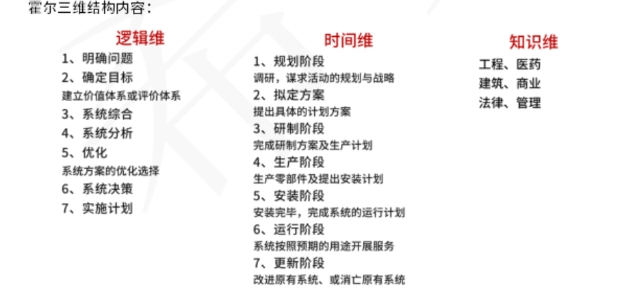

# 系统工程

**系统工程** ☆&#x20;

<mark style="color:blue;">整体最优化</mark>

方法：

**霍尔三维结构（硬科学方法论）**

&#x20;关键点： 逻辑维 （解决问题的逻辑过程） 时间维 （工作进程） 知识维（专业科学知识）

应用场景：组织和管理大型工程建设项目

<figure><figcaption></figcaption></figure>

**切克兰德方法（软科学方法论）**&#x20;

核心不是最优化 而是<mark style="color:purple;">比较和探寻</mark>

7步骤 <mark style="color:purple;">认识问题 根底定义 建立概念模型 比较及探寻 选择 设计与实施 评估与反馈</mark>

**并行工程方法**&#x20;

<mark style="color:purple;">**制造过程**</mark><mark style="color:purple;">与</mark><mark style="color:purple;">**支持过程**</mark><mark style="color:purple;">并行</mark>&#x20;

**强调三个方面** <mark style="color:purple;">1 产品设计开发期间，最快速度按质完成 2 各项工作问题协调解决 3 适当的信息系统工具</mark>

**综合集成法**&#x20;

<mark style="color:purple;">钱学森命名</mark>&#x20;

<mark style="color:purple;">【简单系统】 和 【巨系统】 四原则： 整体论原则 相互联系原则 有序性原则 动态原则</mark>

**WSR系统方法**&#x20;

实践准则： <mark style="color:purple;">懂物理 明事理 通人理</mark>

**信息系统的生命周期** ☆&#x20;

<mark style="color:blue;">阶段： 探索性研究->概念阶段->开发阶段->生产阶段->使用阶段->保障阶段->退役阶段</mark>

方法： 计划驱动方法：需求->设计->构建->测试->部署&#x20;

渐进迭代式开发&#x20;

<mark style="color:purple;">精益开发</mark> 起源于<mark style="color:purple;">丰田 是一个动态的 知识驱动的 以客户为中心的过程</mark>&#x20;

敏捷开发&#x20;

更好的灵活性

原则：&#x20;

<mark style="color:purple;">1 高层管理人员介入原则 如：CIO接入</mark>&#x20;

<mark style="color:purple;">2 用户参与开发原则</mark>&#x20;

<mark style="color:purple;">3 自顶向下规划原则</mark>&#x20;

<mark style="color:purple;">4 工程化原则：引入【软件工程】</mark>&#x20;

<mark style="color:purple;">5 其它原则：创新性原则 整体性原则 发展性原则 经济性原则</mark>

**软件开发方法** ☆☆&#x20;

**结构化开发方法** <mark style="color:purple;">自顶向下 逐步分解，严格区分工作阶段，每阶段有任务与成果，强调系统开发过程的整体性和全局性，开发目标清晰化，工作阶段程式化，开发文档规范化，设计方法结构化。</mark>

优点： <mark style="color:purple;">理论基础严密，他的指导思想是用户需求在系统建立之前就能被充分了解和理解。由此可见，结构化方法注重开发过程的整体性和全局性。</mark>

缺点： <mark style="color:purple;">开发周期长；文档、设计说明繁琐，工作效率低；要求在开发之初全面认识系统的信息需求，充分预料各种可能发生的变化，并不现实；如有用户参与系统开发积极性没有调动，就会造成系统交接过程不平稳，使系统运行与维护管理难度加大。 阶段固化，应变能力差，适用于需求明确的开发场景。</mark>

**原型法开发方法**&#x20;

适用于<mark style="color:purple;">需求不明确</mark>的开发

按功能&#x20;

<mark style="color:purple;">水平原型（界面） 垂直原型（复杂算法）</mark>

按结果&#x20;

<mark style="color:purple;">抛弃式原型：系统真正实现后就不用了</mark>&#x20;

<mark style="color:purple;">演化式原型：从目标系统的一个或几个基本需求出发，通过修改和追加功能逐渐丰富，演化成最终系统。</mark>

**面向对象方法**&#x20;

最早源于仿<mark style="color:purple;">真领域</mark>&#x20;

特点： <mark style="color:purple;">系统描述及信息模型表示与客观实体相对应 符合人们的思维习惯，有利于系统开发过程中用户与开发人员交流和沟通，缩短开发周期，提供系统开发的准确性和效率。具有更好的复用性，关键在于建立一个全面、合理、统一的模型，分析、设计、实现三个阶段界限不明确。</mark>

OMT是<mark style="color:purple;">面向对象建模技术</mark>（<mark style="color:purple;">UML</mark>前身）。

用OMT方法开发软件，通常需要建立三种形式的模型：<mark style="color:purple;">对象模型（描述系统数据结构）、动态模型（描述系统控制结构）、功能模型（描述系统功能）</mark>。

**面向服务的方法**&#x20;

以<mark style="color:purple;">颗粒度、松散耦合</mark>的系统功能为核心 强调<mark style="color:purple;">系统功能的标准化和构件化</mark> 加强了系统的<mark style="color:purple;">灵活性、可复用性和可演化性</mark>。

**信息系统的分类** ☆☆☆

**业务处理系统 TPS（电子数据处理系统）** （<mark style="color:purple;">最低级 最基础的信息系统</mark>）&#x20;

关键点： 早期最初级的信息系统&#x20;

功能： 数据输入 数据处理【批处理、OLTP】 数据库维护 文件报表产生

**管理信息系统 MIS** （引进大量管理方法对企业整体信息进行处理）&#x20;

高度集成化的人机信息系统

金字塔结构：分多个层级&#x20;

四大部件： 信息源 信息处理器 信息用户 信息管理者&#x20;

批处理系统属于【开环系统】&#x20;

计算机实时处理系统属于【闭环系统】

**决策支持系统DSS**&#x20;

关键点： 由<mark style="color:purple;">语言系统、知识系统和问题处理系统</mark>组成 用于<mark style="color:purple;">辅助决策、支持决策（不能提高效率）</mark>&#x20;

特征：

&#x20;1 数据和模型是DSS的主要资源&#x20;

2 DSS用来支援用户做决策而不是代替用户做决策

&#x20;3 DSS主要解决<mark style="color:purple;">半结构化及非结构化问题</mark>&#x20;

4 DSS的作用在于<mark style="color:purple;">提高决策的有效性而不是提高决策的效率</mark>

**专家系统（ES）**&#x20;

内部具有<mark style="color:purple;">专家水平的大量知识与经验</mark> 进行判断与决策&#x20;

可处理不确定的知识 适用于特定的区域&#x20;

关键点： 知识+推理 = 专家系统&#x20;

人工智能一个重要分支

**知识库**：存储求解实际问题的领域知识 **推理机**【规则解释器】&#x20;

知识获取：知识的编辑求精以及知识自学&#x20;

解释程序：面向用户服务

**办公自动化系统（OAS）**&#x20;

关键点： 由计算机设备、办公设备、数据通信及网络设备、软件系统组成。

**企业资源计划【ERP】**&#x20;

关键点： 打通供应链，集成，整合。
