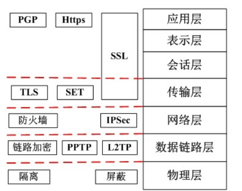

# 2025.2.10

1

* 权衡点是影响<mark style="color:purple;">多个质量属性</mark>的特性 是<mark style="color:purple;">多个质量属性的敏感点</mark>
* 风险点：可能<mark style="color:purple;">引起风险</mark>的因素
* 非风险点：某件事是<mark style="color:purple;">可行的 可接受的</mark>

2&#x20;

构件失配 主要包括系统<mark style="color:purple;">对构件基础、控制模型和数据模型的假设</mark>存在<mark style="color:purple;">冲突</mark>引起的失配

连接子失配 包括由于系统对<mark style="color:purple;">构件交互协议、构件连接子数据格式的假设存在冲突</mark>引起的失配

3

* ATAM架构权衡分析方法 是针对 <mark style="color:purple;">性能 可用性 安全性 可修改性</mark>进行评价和折中的
* 包括<mark style="color:purple;">需求收集、架构视图描述、属性模型构造和分析、架构决策与折中</mark>强调<mark style="color:purple;">属性</mark>
* 架构复审 （使用ATAM对架构质量属性进行评审） 使用基于<mark style="color:purple;">质量</mark>属性的评估方法
* （建立<mark style="color:purple;">质量效用树</mark>） 用于对架构设计进行复审 并 标识 其中的潜在危险

4

* 软件系统架构是关于软件系统 <mark style="color:purple;">结构 行为 和 属性</mark>的高级抽象
* 主要描述直接构成系统抽象组件间的<mark style="color:purple;">连接规则</mark>，特别是相对细致地描述组件的<mark style="color:purple;">交互关系</mark>
* 软件系统架构不仅指定了软件系统的<mark style="color:purple;">组织</mark>和<mark style="color:purple;">拓扑</mark>结构，还包括<mark style="color:purple;">设计决策和基本原理</mark>

5

* CISC 实现方式<mark style="color:purple;">微程序控制</mark>技术
* <mark style="color:blue;">研制周期长 可变长格式 数量多</mark>
* RISC 实现方式 <mark style="color:purple;">增加了通用寄存器 硬布线逻辑控制</mark>为主 适合采用<mark style="color:purple;">流水线</mark>
* <mark style="color:blue;">优化编译 有效支持高级语言</mark>
* <mark style="color:blue;">数量少 定长格式</mark>

6

* ARP是针对<mark style="color:blue;">以太网地址解析协议</mark>攻击技术
* 无法跨网段通信的原因是<mark style="color:purple;">伪造网关ARP报文使得数据包无法发送到网关</mark>

7

* 软件架构文档要从<mark style="color:purple;">使用者</mark>的角度进行编写（<mark style="color:purple;">不是架构设计者</mark>！！！）

8

* <mark style="color:purple;">系统模块化程度较高</mark>时 采用 <mark style="color:purple;">快速应用开发模型</mark>（基于<mark style="color:purple;">构件</mark>的开发方法获得快速开发）
* <mark style="color:purple;">螺旋模型</mark>分成多个阶段，每一个阶段都由<mark style="color:purple;">目标设定、风险分析、开发和有效性验证以及评审构成</mark>。

&#x20;9

* 构件是一组通常<mark style="color:purple;">需要同时部署的原子构件</mark>
* 一个模块是不带单独资源的原子构件&#x20;

10

<figure><figcaption></figcaption></figure>

11 计算机采用<mark style="color:purple;">分级存储体系</mark>的主要目的是为了：<mark style="color:purple;">解决存储容量、价格和速度</mark>之间矛盾 （速度快 价格高，速度慢 价格低，分级能得到很好的性价比）

12 JTAG是一种国际标准测试协议 主要用于<mark style="color:blue;">芯片内部测试</mark> （用来进行<mark style="color:purple;">嵌入式系统中CPU调试</mark>）

13 软件架构设计活动将已标识构件集成到软件架构中 设计但<mark style="color:purple;">不需要实现这些构件</mark>

14 现代的编译器采用以<mark style="color:purple;">数据共享为中心</mark>的架构风格，分析树是在语法分析阶段结束后才产生作为语法分析的输入，分析树是<mark style="color:purple;">数据中心中重要的共享数据</mark>，为后续的<mark style="color:purple;">语义分析</mark>提供了帮助，

15

* 根据系统功能要求，<mark style="color:purple;">从具体的器件、逻辑部件或者相似系统</mark>开始，通过对其进行<mark style="color:purple;">相互连接、修改和扩大</mark>，构成所要求的系统描述的是<mark style="color:purple;">自底向上的开发</mark>。
* <mark style="color:purple;">形式化方法</mark>是一种<mark style="color:purple;">具有坚实数学基础</mark>的方法 对<mark style="color:purple;">系统和开发做严格处理和论证</mark>适用于那些<mark style="color:purple;">系统安全级别极高</mark>的软件开发
* <mark style="color:purple;">非形式化方法</mark>则<mark style="color:purple;">不把严格性作为其主要着眼点</mark>，通常以<mark style="color:purple;">各种开发模型的形式</mark>得以体现。从适应范围来看，可分为<mark style="color:purple;">整体性方法</mark>与<mark style="color:purple;">局部性方法</mark>。
* 适用于<mark style="color:purple;">软件开发全过程的</mark>方法称为<mark style="color:purple;">整体性方法</mark>;
* 适用于<mark style="color:purple;">开发过程某个具体阶段</mark>的软件方法称为<mark style="color:purple;">局部性方法</mark>。

16

* 模块的接口是模块与其他模块进行交互的部分，所以<mark style="color:purple;">接口的定义不仅仅属于其模块自身的内部特性，与外部模块也具有相关性</mark>。

&#x20;17

* 软件开发工具用来辅助开发人员进行软件开发活动，对应软件开发过程的各种活动，软件开发工具包括<mark style="color:purple;">需求分析工具、设计工具、编码与排错工具、测试工具</mark>等。
* 基于自然语言或图形描述的工具
* 基于形式化需求定义语言的工具（具有<mark style="color:purple;">一个知识库和一个推理机制</mark>）

18

* 敏捷方法适合于<mark style="color:purple;">开发团队较小</mark>的项目。

19

* 水平子系统是指从楼层管理间到信息插口这一段，它连接了<mark style="color:purple;">垂直干线子系统</mark>与<mark style="color:purple;">工作区子系统</mark>。

20

* <mark style="color:purple;">软件生命周期模型</mark>是为了<mark style="color:purple;">更好地管理、维护和升级软件</mark>，其中更大的意义在于<mark style="color:purple;">管理软件开发的步骤和方法</mark>。
* 是以<mark style="color:purple;">需求</mark>为出发点，从<mark style="color:purple;">提出软件开发计划</mark>的那一刻开始，直到软件在实际应用中<mark style="color:purple;">完全报废</mark>为止。（没有新的生命周期）

21 构件定义为<mark style="color:purple;">通过接口访问服务的一个独立可交付的功能单元</mark>。

22 软件重用是指在<mark style="color:purple;">两次或多次不同的软件开发过程中重复使用相同或相似软件元素</mark>的过程。 按照重用活动<mark style="color:purple;">是否跨越相似性较少的多个应用领域</mark>，软件重用可以区别为<mark style="color:purple;">横向重用</mark>和<mark style="color:purple;">纵向重用</mark>。&#x20;

横向重用是指<mark style="color:purple;">重用不同应用领域中的软件元素</mark>，例如数据结构、分类算法和人机界面构建等。&#x20;

<mark style="color:purple;">标准函数</mark>是一种典型的、原始的<mark style="color:purple;">横向重用</mark>机制。 <mark style="color:purple;">纵向重用</mark>是指在-类具有较多公共性的应用领域之间进行软部件重用。

&#x20;纵向重用活动的主要关键点是<mark style="color:purple;">域分析</mark>:根据<mark style="color:purple;">应用领域的特征及相似性预测软部件的可重用性</mark>。
